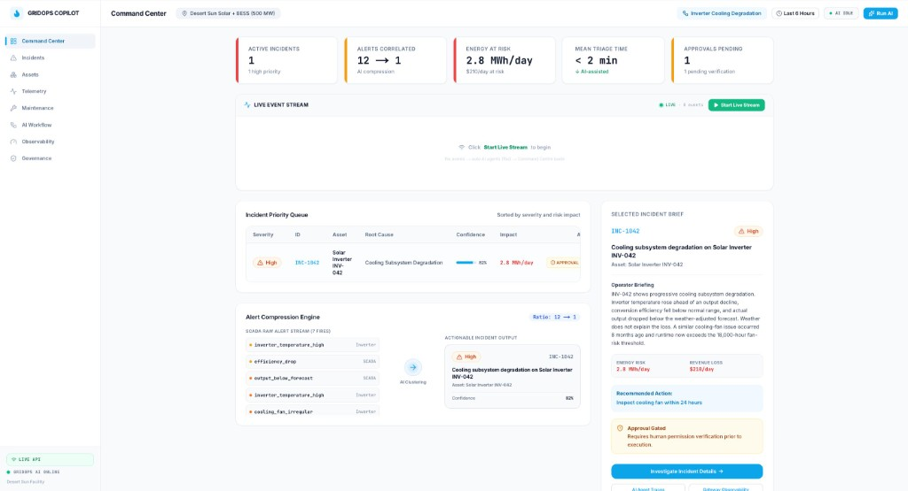
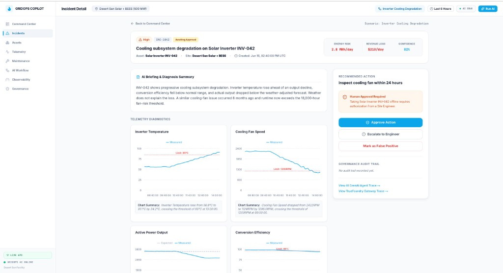

# GridOps Copilot

> **AI-powered operations copilot for renewable energy infrastructure**  
> Hackathon: *TrueFoundry × CrewAI — From Prototype to Production: Real-World AI Agents*

---

## 1. Problem & Use Case

### The Problem

Utility-scale renewable energy facilities (solar farms, BESS) generate thousands of raw
sensor alerts every hour. A 500 MW facility can fire **12+ overlapping SCADA alerts** from
a single inverter fault — temperature spikes, fan failures, power deviations — all
arriving within minutes of each other. Today, operators:

- Manually triage each alert in isolation
- Miss correlated root causes buried in alert noise
- React hours later, after MWh of generation is already lost
- Have no structured way to enforce governance (who approved taking an asset offline?)

### Our Solution

**GridOps Copilot** ingests real-time telemetry, compresses alert noise, and deploys a
9-agent CrewAI crew that produces **one explainable incident per asset** — with root cause,
business impact, recommended action, and a governance gate for human approval.

```
Raw SCADA stream (telemetry + alerts + weather + forecast)
        ↓
Anomaly Scoring + Alert Correlation Engine
        ↓
9-Agent CrewAI Pipeline (via TrueFoundry AI Gateway)
        ↓
ONE Actionable Incident:
  root cause · confidence · evidence · energy loss (MWh/day)
  recommended action · governance gate · operator briefing
```

### Why It Matters

| Metric | Without GridOps | With GridOps |
|--------|----------------|-------------|
| Alerts to review | 12+ raw alerts | 1 incident |
| Time to triage | 45–90 minutes | < 2 minutes |
| Root cause clarity | Manual correlation | AI-generated with evidence |
| Governance | Ad-hoc | Structured approval gate |
| Revenue protected | Unknown | $210–$480/day per incident |

**Target users:** Grid operators, O&M teams, energy asset managers at utility-scale renewable facilities.

---

## 2. Technical Execution

### System Architecture

```
NumPy Physics Simulator (stream_live.py)
    │
    ├──[HTTP POST]──→ Ingestion Service (port 8002)
    │                     │
    │                     ├── Pydantic v2 envelope validation
    │                     ├── State store (rolling telemetry window)
    │                     ├── Anomaly scoring → Anomaly Service (port 8001)
    │                     ├── Alert correlation → incident candidate
    │                     ├── SSE broadcast → frontend Live Event Feed
    │                     └──[background]──→ CrewAI Service (port 8003)
    │                                               │
    └──[Kafka]──→ gridops.raw.events ───────────────┘
                  (opt-in, KAFKA_BOOTSTRAP_SERVERS)
                                               │
                                     TrueFoundry AI Gateway
                                     (routes to GPT-4o-mini / GPT-4o)
                                               │
                                     9 CrewAI Agents (sequential)
                                               │
                                     Incident Report API (port 8000)
                                               │
                                     Next.js Frontend (port 3000)
```

### Key Technical Decisions

| Decision | Choice | Reason |
|----------|--------|--------|
| Event schema | Pydantic v2 with `schema_version` + `correlation_id` | Forward-compatible, validation at ingest boundary |
| LLM routing | TrueFoundry AI Gateway | Unified observability, cost tracking, key rotation |
| Agent framework | CrewAI sequential crew | Deterministic execution order for audit compliance |
| Real-time feed | Server-Sent Events (SSE) | Simple, browser-native, no WebSocket overhead |
| Event bus | HTTP (demo) + Kafka (production) | Gradual migration path, `--sink both` flag |
| Data generation | NumPy physics simulator | Physics-based degradation curves, not random noise |
| Human-in-the-loop | Governance gate in Agent 8 | Regulatory compliance — no automated asset-offline actions |

### 9-Agent CrewAI Pipeline

```
1. Alert Correlation Agent     → groups overlapping alerts into incident window
2. Telemetry Analysis Agent    → analyzes temperature/fan/power via ML scoring
3. Maintenance History Agent   → checks asset service records & runtime hours
4. Weather & Forecast Agent    → rules out weather as root cause
5. Root Cause Agent            → synthesizes 1–4 → root cause + confidence
6. Business Impact Agent       → calculates energy loss (MWh/day) + revenue ($/day)
7. Maintenance Recommendation  → recommends corrective action + urgency window
8. Safety Governance Agent     → applies governance rules → human approval gate
9. Operator Briefing Agent ★   → writes plain-English briefing (GPT-4o)
```

### Quick Start

```bash
# Clone and configure
cp .env.example .env
# Set TFY_GATEWAY_BASE_URL and TFY_API_KEY in .env

# Start everything (backend + frontend) in one command
./run_demo.sh
# → Opens at http://localhost:3000

# Or with Docker
docker compose up
```

### Repository Structure

```
GridOps/
├── .env / .env.example          ← credentials (never committed)
├── run_demo.sh                  ← one-command full-stack launcher
├── docker-compose.yml           ← Docker orchestration
├── PRODUCTION_READINESS.md      ← detailed production assessment
├── frontend/                    ← Next.js 14 App Router UI
└── backend/
    ├── agents/                  ← CrewAI 9-agent pipeline (port 8003)
    ├── common/                  ← Pydantic v2 envelope + shared schemas
    ├── config/                  ← environment settings
    ├── services/
    │   ├── anomaly_service/     ← ML anomaly scoring (port 8001)
    │   ├── ingestion_service/   ← event ingest + correlation + SSE (port 8002)
    │   └── incident_api/        ← incident REST API (port 8000)
    ├── scripts/                 ← stream_live.py (physics simulator + Kafka producer)
    ├── data/                    ← assets, scenarios, eval reports, maintenance records
    ├── evaluation/              ← eval harness + metrics
    ├── tfy/                     ← TrueFoundry deployment YAML
    └── requirements.txt
```

---

## 3. Innovation & Creativity

### What Makes GridOps Copilot Different

**1. Physics-Based Synthetic Data — Not Random Noise**  
`stream_live.py` uses NumPy differential equations to simulate real inverter cooling
degradation: `temp = base_temp + (1 - cooling_eff) × thermal_rise`. The simulator has
three phases (Normal → Degrading → Critical) that produce statistically realistic alert
patterns — exactly what a real SCADA system would emit.

**2. Alert Compression Engine**  
The correlation engine ingests 12 raw alerts and outputs 1 incident candidate.
The frontend visualizes this as a compression ratio (12 → 1) with the full alert
stream visible in the Live Event Feed ticker — judges can literally watch the noise
get compressed in real time.

**3. End-to-End Traceability**  
Every incident report stores the TrueFoundry trace IDs for all 9 LLM calls —
`all_call_trace_ids` — enabling per-agent cost and latency attribution on the
TrueFoundry gateway dashboard.

**4. Human-in-the-Loop Governance**  
Agent 8 checks `config/governance_rules.yaml` and sets `approval_required: true`
for any action that requires taking an asset offline. The UI enforces this gate —
the "Approve" button is gated, the audit trail is immutable, and every decision
is logged with actor + timestamp + reason.

**5. Dual-Path Event Bus (HTTP + Kafka)**  
The same ingestion pipeline accepts events via both HTTP POST and a Kafka consumer
topic (`gridops.raw.events`). Operators can start with HTTP (zero infrastructure)
and switch to Kafka for production scale without changing any application code —
just set `KAFKA_BOOTSTRAP_SERVERS`.

**6. Scripted Live Demo with Auto-Navigation**  
The demo is a fully scripted 35-second story arc: events stream → page auto-navigates
to AI Workflow → agents animate one-by-one → page returns to Command Centre → KPI
cards reveal with staggered animation. No manual clicking required during the demo.

---

## 4. Production Readiness

GridOps Copilot is designed with production-grade patterns throughout:

| Layer | Implementation |
|-------|---------------|
| **LLM Gateway** | All 9 agents route through TrueFoundry AI Gateway — unified key, cost tracking, trace IDs, fallback to direct OpenAI if gateway unreachable |
| **Containerisation** | 4 Dockerfiles with non-root users, HEALTHCHECK, and resource limits |
| **K8s / TFY Deploy** | `backend/tfy/truefoundry.yaml` — one-command deploy of all 4 services with horizontal scaling, secret injection, readiness probes |
| **Kafka** | Optional Kafka consumer in ingestion service (activate via `KAFKA_BOOTSTRAP_SERVERS`) + Kafka producer in `stream_live.py` (`--sink kafka`) |
| **Reliability** | `max_iter=5` + `max_retry_limit=2` per CrewAI agent; LLM fallback chain (Gateway → OpenAI → mock report) |
| **Observability** | Real TFY trace IDs captured via LiteLLM callback; per-agent token counts and cost stored in every incident report |
| **Audit Trail** | Every human decision (approve/reject/work_order) is immutably logged with actor + timestamp |
| **Evaluation** | Ground truth JSON for all 4 scenarios; eval harness checks root cause accuracy, false escalation rate, confidence calibration |

**→ Full assessment: [PRODUCTION_READINESS.md](./PRODUCTION_READINESS.md)**

---

## Environment Variables

| Variable | Description | Required |
|----------|-------------|----------|
| `TFY_GATEWAY_BASE_URL` | TrueFoundry AI Gateway base URL | Yes |
| `TFY_API_KEY` | TrueFoundry API key | Yes |
| `OPENAI_API_KEY` | Direct OpenAI fallback key | Optional |
| `ENERGY_PRICE_PER_MWH` | Energy price for impact calculation | No (default: 75) |
| `KAFKA_BOOTSTRAP_SERVERS` | Enable Kafka consumer in ingestion service | No |
| `ANOMALY_SERVICE_URL` | Anomaly service URL | No (default: localhost:8001) |

---

## Evaluation

```bash
# Run all 4 scenarios and evaluate against ground truth
cd backend && python scripts/run_all_scenarios.py
python evaluation/run_eval.py --reports data/eval_reports/ --ground-truth data/ground_truth.json
```

Target: 4/4 scenarios pass · `root_cause_accuracy = 1.0` · `false_escalation_rate = 0.0`

---

## TrueFoundry Deployment

```bash
# Deploy all 4 microservices to TrueFoundry managed K8s
servicefoundry deploy --file backend/tfy/truefoundry.yaml --workspace <workspace-fqn>

# Or with Docker Compose (local)
docker compose up

# With Kafka (Redpanda)
docker compose --profile kafka up
```

---

## 5. How the System Works

### Two operating modes

| Mode | Config | What runs |
|------|--------|-----------|
| **Fixture** | `NEXT_PUBLIC_USE_LIVE_API=false` | Frontend only — hardcoded demo data in `frontend/data/scenarios.ts` |
| **Live** | `NEXT_PUBLIC_USE_LIVE_API=true` | Frontend + 4 backend services — real pipeline with synthetic JSONL events and LLM reasoning |

In **fixture mode**, clicking **Run AI Analysis** animates the 9 agents and reveals pre-written incidents — no backend required.

In **live mode**, the same button triggers the full pipeline: stream events → correlate alerts → run CrewAI → store incident → display in the UI.

### End-to-end data flow (live mode)

```
User clicks "Run AI Analysis"
        ↓
POST /api/scenarios/{scenario}/run          (Incident API :8000)
        ↓ reset + set_context + stream JSONL
POST /ingest (per event)                    (Ingestion :8002)
        ↓ updates in-memory state per asset
On each alert → POST /score                 (Anomaly :8001, rule-based)
        ↓ anomaly_score ≥ 0.6 AND alert_count ≥ 3
Incident candidate emitted
        ↓ background task
POST /run_incident                          (CrewAI :8003, 9 agents via TrueFoundry Gateway)
        ↓
POST /api/reports                           (Incident API :8000)
        ↓
Frontend polls GET /api/incidents → maps to UI via adapters.ts
```

### Where the data comes from

There is **no real SCADA connection**. All data is synthetic but physics-informed:

| Layer | Source | Purpose |
|-------|--------|---------|
| **Event streams** | `data/scenarios/<scenario>/*.jsonl` | Telemetry, alerts, weather, forecast, maintenance, dispatch |
| **Asset inventory** | `data/assets.json` | 284 assets at Desert Sun Solar + BESS |
| **Maintenance history** | `data/maintenance_records.json` | Prior cooling-fan issues, runtime hours |
| **Manufacturer notes** | `data/manufacturer_notes.json` | Fan-risk threshold at 18,000 runtime hours |
| **Ground truth** | `data/ground_truth.json` | Eval labels for all 4 scenarios |
| **UI fixtures** | `frontend/data/scenarios.ts` | Fallback demo data when backend is offline |

Events are generated by `scripts/generate_synthetic_data.py` (or streamed live via `stream_live.py`) and shaped as Kafka-compatible JSON envelopes with Pydantic validation at ingest.

### Four demo scenarios

| ID | Scenario | Incident? | Focal asset | What it proves |
|----|----------|-----------|-------------|----------------|
| SCN-A | Normal Operation | No | — | System stays quiet under nominal conditions |
| SCN-B | Inverter Cooling Degradation | **Yes** | INV-042 | 12 raw alerts → 1 incident; cooling fan degradation |
| SCN-C | BESS Thermal Risk | **Yes** | BESS-011 | Critical thermal management under grid dispatch |
| SCN-D | Weather False Positive | No | — | Weather-explained output drop does **not** escalate |

### TrueFoundry's role

1. **AI Gateway** — All CrewAI LLM calls route through `TFY_GATEWAY_BASE_URL` (OpenAI-compatible). Provides cost tracking, latency, and trace IDs. Falls back to `OPENAI_API_KEY` if the gateway is unreachable.

2. **Anomaly Service deployment** — The rule-based `/score` endpoint is packaged as a TrueFoundry-deployable microservice (`backend/tfy/truefoundry.yaml`). It is **not** an LLM — it uses deterministic feature scoring.

3. **Observability** — Each incident report stores a `trace` block (`tfy_trace_id`, `llm_calls`, `total_latency_ms`, `total_cost_usd`) viewable on the **Observability** screen and the TrueFoundry gateway dashboard.

### CrewAI agent workflow (sequential)

```
1. Alert Correlation      → groups overlapping SCADA alerts into one cluster
2. Telemetry Analysis     → thermal ramp, fan instability, temp-before-power ordering
3. Maintenance History    → prior similar issue, runtime above 18k-hour threshold
4. Weather & Forecast     → weather-adjusted check — equipment fault vs weather
5. Root Cause             → synthesizes evidence → single root cause + confidence
6. Business Impact        → energy loss (MWh/day) + revenue ($/day) at $75/MWh
7. Recommendation         → standardized action from controlled vocabulary
8. Safety / Governance    → approval_required, escalation level
9. Operator Briefing ★    → plain-English summary (GPT-4o)
```

Agents 1–8 use **gpt-4o-mini**; Agent 9 uses **gpt-4o**. Each agent has tools that read from the ingestion state store or fall back to scenario JSONL files on disk.

### Governance flow

When an incident is created (`status: awaiting_approval`):

1. Operator reviews evidence, telemetry charts, and the AI briefing
2. Clicks **Approve Action** → `POST /api/incidents/{id}/decision`
3. Backend logs the decision in the audit trail and simulates work-order creation
4. No automated grid control — AI is decision **support**, not autonomous action

### UI walkthrough — Scenario B (Inverter Cooling Degradation)

**Command Center** — KPI cards, alert compression (12 → 1), and the operator briefing:



**Incident Detail** — telemetry diagnostics, evidence-backed root cause, and the human approval gate:



Key numbers for this scenario: **2.8 MWh/day** at risk · **$210/day** revenue loss · **82% confidence** · recommended action: *inspect cooling fan within 24 hours*.

### Backend API reference

| Service | Port | Key endpoints |
|---------|------|---------------|
| Incident API | 8000 | `GET /api/incidents`, `POST /api/scenarios/{name}/run`, `POST /api/incidents/{id}/decision` |
| Anomaly | 8001 | `POST /score` |
| Ingestion | 8002 | `POST /ingest`, `POST /set_context`, `POST /reset` |
| CrewAI | 8003 | `POST /run_incident` |

Interactive docs: `http://localhost:8000/docs` (with services running).

---

*GridOps Copilot — Built for TrueFoundry × CrewAI Hackathon, June 2026*  
*Desert Sun Solar + BESS Facility (500 MW) · 9 CrewAI Agents · TrueFoundry AI Gateway*
